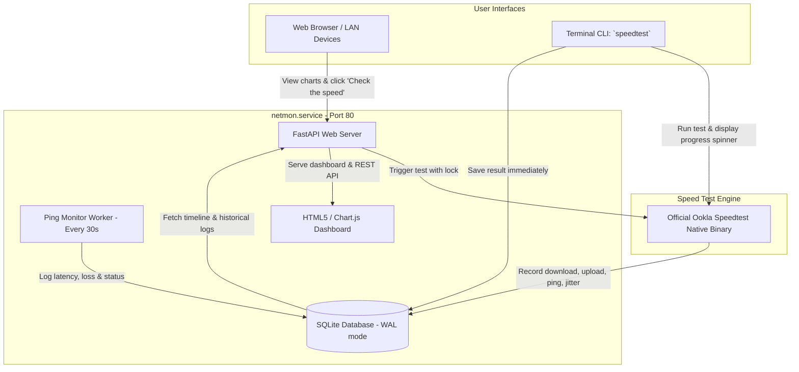

# NetMon 🌐

> Lightweight, self-hosted Internet Availability & Speedtest Monitor designed for the Raspberry Pi.

NetMon runs continuously in the background on your local Raspberry Pi, monitoring internet uptime and ping latency every 30 seconds, providing an interactive dark-mode web dashboard on port 80, and featuring a CLI `speedtest` utility that integrates directly with the web UI and historical database.

---

## 🏗️ Architecture



---

## ✨ Features

- **Continuous Ping & Outage Tracking**: Pings reliable public DNS servers (`1.1.1.1` and `8.8.8.8`) every 30 seconds to record latency, jitter, and packet loss.
- **Interactive Modern Dashboard**:
  - **Availability & Ping Timeline**: Interactive time-series chart with quick zoom filters (`1h`, `6h`, `24h`, `7d`) and visual outage detection.
  - **Speedtest Performance Chart**: Side-by-side Download and Upload bar/column chart.
  - **Historical Speedtest Table**: Chronological table with timestamp, speeds, ping, jitter, ISP, and Ookla result link.
  - **"Check the speed" Button**: One-click test from the browser with live spinner and status polling.
  - **100% Offline-Resilient UI**: Chart.js is bundled locally so the dashboard loads and functions even during an internet blackout.
- **Official Ookla Speedtest Engine**: Uses the native 64-bit ARM (`aarch64`) binary for accurate measurements on high-speed connections without Python CPU bottlenecks.
- **Terminal CLI Integration**: Typing `speedtest` in the terminal runs an interactive test with a spinner, displays a formatted summary, and automatically syncs the result to the web dashboard.
- **Lightweight & Efficient**: Built with FastAPI and SQLite (WAL mode). Uses less than 40 MB RAM. Automatically prunes logs older than 30 days.
- **Port 80 System Service**: Starts on boot via systemd with Linux capability `CAP_NET_BIND_SERVICE`, running securely as an unprivileged user without needing root privileges.

---

### Prerequisites
Ensure `python3-venv` and `curl` are installed:
```bash
sudo apt update && sudo apt install -y python3-venv curl
```

### 1. Clone the Repository
```bash
git clone https://github.com/dlipper/netmon.git
cd netmon
```

### 2. Run the Installer
```bash
./install_service.sh
```
*(Enter your sudo password when prompted)*

The installer will:
1. Create the Python virtual environment and install dependencies (`fastapi`, `uvicorn`).
2. Download the native Ookla Speedtest binary for your system architecture.
3. Symlink `speedtest` into `~/.local/bin/` and `/usr/local/bin/`.
4. Install, enable, and start `netmon.service` on port 80.

---

## 🖥️ Web Dashboard Access

Once started, open your browser:
- **Local machine:** [http://localhost](http://localhost) or [http://127.0.0.1](http://127.0.0.1)
- **Local network (LAN):** `http://<raspberry-pi-ip>` (e.g. `http://192.168.2.5`)

---

## ⌨️ Command-Line Usage

You can test your internet speed directly from any terminal window:

```bash
speedtest
```

### Example Terminal Output:
```text
==================================================
      NetMon Speedtest & Internet Monitor         
==================================================

✓ Speedtest Complete!

  • Server   : Example Server (Vienna)
  • ISP      : Example ISP (IP: 198.51.100.42)
  • Ping     : 12.93 ms (Jitter: 0.99 ms)
  • Loss     : 0.0%
  • Download : 36.55 Mbps
  • Upload   : 9.43 Mbps
  • Result   : https://www.speedtest.net/result/c/00000000-0000-0000-0000-000000000000

✓ Saved to NetMon database and synced to web dashboard.
```

---

## ⚙️ Service Management

The background service is managed via systemd:

```bash
# Check service status
sudo systemctl status netmon.service

# Restart the service
sudo systemctl restart netmon.service

# Stop the service
sudo systemctl stop netmon.service

# View live application logs
sudo journalctl -u netmon.service -f
```

### Running Manually (Without systemd)
If you prefer to run the server manually without root or systemd:
```bash
./venv/bin/uvicorn app.main:app --host 0.0.0.0 --port 8080
```
Then visit `http://<raspberry-pi-ip>:8080`.

---

## 📡 REST API Reference

| Endpoint | Method | Description |
| :--- | :--- | :--- |
| `/` | `GET` | Serves the interactive web dashboard |
| `/api/status` | `GET` | Current online state, latest ping, 24h & 7d uptime % |
| `/api/ping-history` | `GET` | Ping time-series data points (`?hours=1\|6\|24\|168`) |
| `/api/speedtests` | `GET` | List of historical speed test records (`?limit=50`) |
| `/api/speedtest/run` | `POST` | Triggers an on-demand speedtest in the background |
| `/api/speedtest/status` | `GET` | Status check for active speed tests |

---

## 📁 Project Structure

```
netmon/
├── app/
│   ├── __init__.py
│   ├── cli.py              # Terminal speedtest command implementation
│   ├── config.py           # Configuration (targets, intervals, ports, paths)
│   ├── database.py         # SQLite models, connection, WAL mode & queries
│   ├── main.py             # FastAPI REST API & static file router
│   ├── ping_monitor.py     # Background ICMP ping worker
│   ├── speedtest_runner.py # Native Ookla execution & parsing
│   └── static/
│       ├── app.js          # Chart.js initialization & real-time polling
│       ├── index.html      # Responsive dark-mode dashboard
│       ├── style.css       # Clean stylesheet
│       └── vendor/
│           └── chart.umd.min.js # Bundled Chart.js for offline use
├── bin/
│   ├── speedtest-cli       # Wrapper script executed by `speedtest`
│   └── speedtest-ookla     # Native Ookla aarch64 binary (auto-downloaded)
├── data/
│   ├── .gitkeep
│   └── netmon.db           # SQLite database (auto-created)
├── install_service.sh      # One-click service & CLI installer
├── netmon.service          # systemd service unit file
├── requirements.txt        # Python dependencies
├── .gitignore
└── README.md
```

---

## 🔒 Security & Network Considerations

- **Local Network (LAN) Scope:** NetMon runs an unauthenticated web dashboard designed for personal use within your trusted local home or office network.
- **Do Not Expose Unprotected to Public Internet:** Do not port-forward port 80 or expose NetMon directly to the public internet without an authentication proxy (such as Nginx with HTTP Basic Auth, Authelia, or an encrypted VPN/Tailscale connection). Unauthenticated public exposure allows anyone to view network telemetry and trigger bandwidth-intensive speed tests.

---

## 📄 License & Third-Party Terms

- **NetMon:** Licensed under the [MIT License](LICENSE).
- **Ookla Speedtest CLI:** NetMon downloads and interfaces with the official native [Speedtest CLI by Ookla](https://www.speedtest.net/apps/cli). Use of the Ookla binary is subject to [Ookla's Terms of Use](https://www.speedtest.net/about/terms) and [Privacy Policy](https://www.speedtest.net/about/privacy).
- **Bundled Assets:** Includes [Chart.js](https://www.chartjs.org/) (MIT License) bundled locally for offline functionality.
